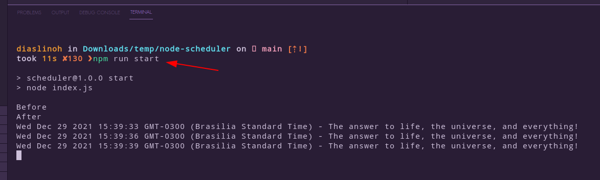

# node-scheduler
Testing Node Scheduler

# Requirements
1. [node 14.18.1](https://nodejs.org/pt-br/download/)
2. [npm](https://www.digitalocean.com/community/tutorials/how-to-install-node-js-on-ubuntu-20-04-pt)

# Setup
```shell
git clone https://github.com/stdioh321/node-scheduler.git
cd node-scheduler
npm install
```

# Run 
```shell
npm run start
```


# References

* https://www.npmjs.com/package/node-schedule